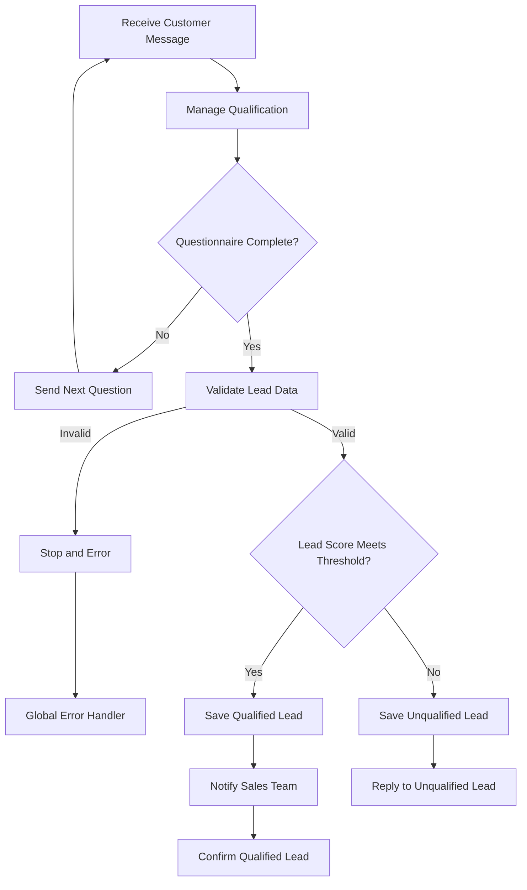

# AI Sales Assistant for Lead Qualification & Follow-up


A complete sales automation system built with **n8n**, **Telegram**, **Google Sheets**, **SMTP Email**, **Docker**, and **PostgreSQL**.

The system automatically receives potential customers, guides them through a structured qualification process, calculates an internal lead score, validates the collected information, and routes each lead to the correct sales path.

Qualified leads are saved automatically, the sales team is notified by email, and the customer receives an immediate confirmation message.

---

## Project Demo

[▶ Watch the full project demonstration](./AI-Sales-Assistant-Video/AI-Sales-Assistant-Video.mp4)

The video demonstrates:

* Customer interaction through Telegram
* Structured lead qualification
* Workflow architecture
* Automatic Google Sheets documentation
* Sales email notifications
* Data validation and error handling

---

## Business Problem

Sales teams often spend a significant amount of time:

* Asking repetitive qualification questions
* Reviewing customers who are not ready to buy
* Copying customer information manually
* Updating spreadsheets
* Sending internal notifications
* Following up with incomplete lead information

This creates unnecessary administrative work and delays the sales process.

---

## Solution

This project automates the complete lead qualification journey.

The system:

1. Receives a customer message through Telegram.
2. Starts a structured ten-question qualification process.
3. Sends one question at a time.
4. Validates every customer response.
5. Stores the customer's current progress.
6. Calculates an internal qualification score.
7. Checks that the final lead data is complete.
8. Separates qualified and unqualified leads.
9. Saves the result automatically in Google Sheets.
10. Notifies the sales team about qualified opportunities.
11. Sends the customer an appropriate confirmation message.
12. Reports critical workflow failures to the administrator.

---

## Workflow Architecture



---

## Main Workflow Components

### 1. Receive Customer Message

The Telegram Trigger receives incoming customer messages and starts the workflow automatically.

### 2. Manage Qualification

This node contains the main qualification logic.

It is responsible for:

* Starting the questionnaire
* Tracking the current question
* Validating customer answers
* Storing questionnaire progress
* Calculating answer scores
* Preparing the final lead information
* Preventing the score from being shown to the customer

### 3. Questionnaire Complete?

This condition determines whether the customer has completed all ten questions.

* If the questionnaire is incomplete, the next question is sent.
* If the questionnaire is complete, the final lead data is validated.

### 4. Validate Lead Data

Before continuing, the workflow verifies that important fields are available and correctly formatted.

Examples include:

* Customer identifier
* Customer response
* Lead score
* Qualification status
* Required business information

Invalid data is stopped before it can reach Google Sheets or the sales team.

### 5. Check Lead Score

The system compares the final qualification score with the configured threshold.

The current qualification threshold is:

```text
70%
```

* Score greater than or equal to 70% → Qualified Lead
* Score below 70% → Unqualified Lead

### 6. Save Lead Results

Qualified and unqualified leads are stored through separate workflow paths.

The saved information can include:

* Customer name
* Telegram username
* Source
* Original customer message
* Business need
* Buying intent
* Budget
* Timeline
* Lead score
* Qualification status
* Sales summary
* Documentation status

### 7. Notify Sales Team

When a lead is qualified, the sales team receives an automatic email containing the most relevant information.

This allows the sales representative to understand the opportunity without manually reviewing the entire Telegram conversation.

### 8. Customer Confirmation

Qualified customers receive a professional confirmation message informing them that the sales team will contact them.

Unqualified customers receive a separate polite response without unnecessarily interrupting the sales team.

---

## Lead Scoring Logic

Each qualification question contains three possible answers.

| Answer level         | Internal score |
| -------------------- | -------------: |
| Low qualification    |              0 |
| Medium qualification |             50 |
| High qualification   |            100 |

The final score is calculated from the customer's answers and converted into a qualification percentage.

The score is used only by the workflow and is not displayed to the customer.

The scoring model evaluates factors such as:

* Business need
* Customer intent
* Budget readiness
* Decision-making authority
* Implementation timeline
* Purchase urgency
* Business suitability

---

## Input Validation

The workflow protects downstream systems by validating data before saving or sending it.

Validation helps prevent:

* Empty customer identifiers
* Missing customer responses
* Invalid score values
* Incomplete lead records
* Incorrect data types
* Unreliable sales notifications

When important data is invalid, the workflow stops safely instead of continuing with incomplete information.

---

## Error Handling

The project includes a dedicated global error-handling workflow.

When a critical workflow execution fails, the error handler can collect information such as:

* Workflow name
* Failed execution
* Error message
* Failed node
* Execution time

An automatic notification is then sent to the administrator.

This improves:

* Workflow reliability
* Error visibility
* Troubleshooting speed
* System maintenance
* Operational monitoring

---

## Technologies Used

| Technology       | Purpose                                   |
| ---------------- | ----------------------------------------- |
| n8n              | Workflow automation and orchestration     |
| Telegram Bot API | Customer communication                    |
| JavaScript       | Qualification and scoring logic           |
| Google Sheets    | Lead documentation and lightweight CRM    |
| SMTP Email       | Sales and administrator notifications     |
| Docker           | Containerized local deployment            |
| PostgreSQL       | Persistent n8n database                   |
| Git and GitHub   | Version control and project documentation |
| OBS Studio       | Project demonstration recording           |
| CapCut           | Video editing and voice-over production   |

---

## Repository Structure

```text
.
├── AI-Sales-Assistant-Video/
│   └── AI-Sales-Assistant-Video.mp4
│
├── docs/
│   ├── screenshots/
│   ├── setup documentation
│   ├── security documentation
│   └── troubleshooting documentation
│
├── n8n-production/
│   ├── compose.yaml
│   └── local environment configuration
│
├── ai_sales_assistant.json
├── .gitignore
└── README.md
```

Sensitive environment files and credentials are excluded from the repository.

---

## Installation

### Prerequisites

Before importing the project, prepare:

* An n8n instance
* A Telegram Bot
* A Google account
* A Google Sheet
* SMTP email credentials
* Docker Desktop for self-hosted deployment

---

## Import the Workflow

1. Download or clone the repository.

```bash
git clone https://github.com/mohamedemad941227-glitch/ai-sales-assistant-n8n.git
```

2. Open n8n.

3. Select:

```text
Import from File
```

4. Import:

```text
ai_sales_assistant.json
```

5. Recreate the required credentials inside n8n.

Credentials are intentionally not included in the exported workflow.

---

## Required Credentials

The workflow requires the following credentials:

### Telegram

Create a Telegram Bot using BotFather and connect its access token inside n8n.

### Google Sheets

Create a Google OAuth2 credential and authorize access to the required spreadsheet.

### SMTP Email

Configure an SMTP account for sales and administrator notifications.

For Gmail, use a Google App Password instead of the main Google account password.

---

## Self-Hosted Deployment

A Docker-based environment is included for running n8n with PostgreSQL.

Navigate to the production directory:

```bash
cd n8n-production
```

Start the containers:

```bash
docker compose up -d
```

Check their status:

```bash
docker compose ps
```

Open n8n locally:

```text
http://localhost:5678
```

For production use, configure:

* A public domain
* HTTPS
* A reverse proxy
* Secure environment variables
* Automated backups
* A permanent webhook URL

---

## Security

The repository does not intentionally contain:

* Telegram Bot tokens
* Google OAuth client secrets
* SMTP passwords
* Google App Passwords
* PostgreSQL passwords
* n8n credentials
* Local environment files

The `.gitignore` file prevents sensitive files from being committed.

Example ignored files:

```gitignore
.env
.env.*
**/.env
**/.env.*
credentials.json
*.secret
node_modules/
```

All credentials must be created securely inside the user's own n8n environment.

---

## Testing Scenarios

The workflow was designed to support several testing scenarios.

### Qualified Lead

The customer selects high-value answers and reaches the qualification threshold.

Expected result:

```text
Save Qualified Lead
→ Notify Sales Team
→ Confirm Customer
```

### Unqualified Lead

The customer receives a score below the threshold.

Expected result:

```text
Save Unqualified Lead
→ Send Professional Reply
```

### Invalid Answer

The customer sends an answer outside the available options.

Expected result:

```text
Explain Valid Choices
→ Repeat Current Question
```

### Missing Data

Required lead information is missing or incorrectly formatted.

Expected result:

```text
Validation Failure
→ Stop Workflow
→ Global Error Handler
```

### External Service Failure

Google Sheets or the email service fails.

Expected result:

```text
Workflow Failure
→ Error Information Collected
→ Administrator Notification
```

---

## Business Value

This automation can help businesses:

* Reduce repetitive sales administration
* Qualify leads consistently
* Improve customer response speed
* Prevent incomplete lead records
* Centralize customer information
* Notify sales representatives immediately
* Reduce unnecessary manual follow-up
* Focus sales effort on stronger opportunities
* Improve workflow visibility and reliability

---

## What This Project Demonstrates

This project demonstrates practical experience in:

* Business process analysis
* Workflow architecture
* Automation design
* Telegram Bot integration
* API-based system integration
* JavaScript business logic
* Lead scoring systems
* Conditional routing
* Data validation
* Error handling
* Google Sheets automation
* Email automation
* Docker deployment
* PostgreSQL persistence
* Credential security
* Technical documentation
* Git and GitHub version control

The project was designed as a complete business automation solution rather than a simple chatbot demonstration.

---

## Possible Future Improvements

Potential future versions may include:

* Website chat integration
* Facebook Lead Ads integration
* CRM integration
* PostgreSQL-based customer session storage
* AI-generated sales summaries
* Calendar booking
* Automated follow-up sequences
* Sales dashboards
* Multi-language support
* Role-based access
* Customer analytics
* VPS deployment with HTTPS
* Automated database backups

---

## Author

**Mohamed Soliman**

Mechanical Engineer and AI Automation Developer focused on building practical automation systems that reduce manual work, improve business processes, and connect multiple platforms through reliable workflows.
